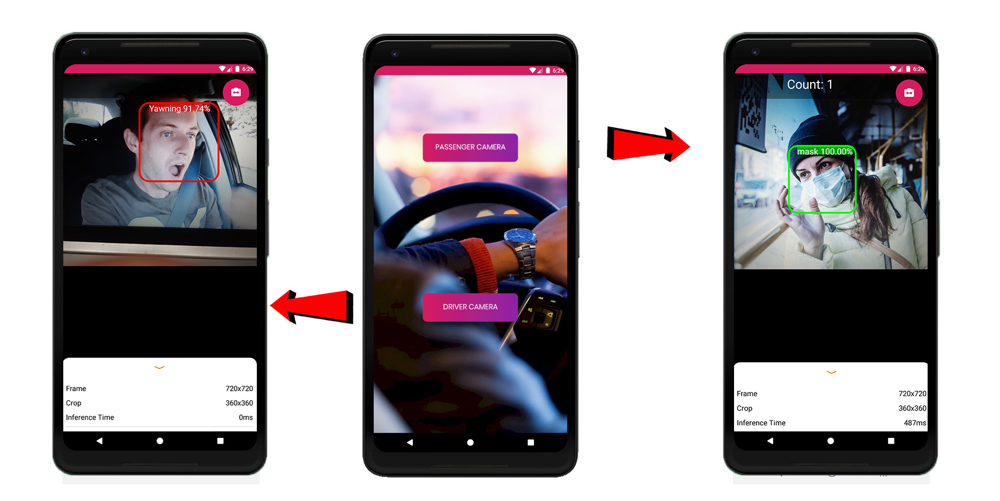
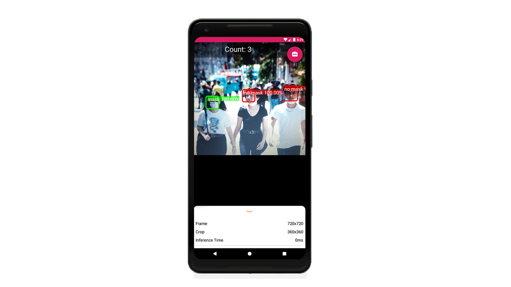

# Driver Behaviour Analysis & Passenger Face-Mask Detection Android Application
## Overview

This app provides the following two functions:
 1) Counting the number of passengers in a public transport and check whether they are wearing masks or not.
 
 2) Monitoring the driver for activities such as eyes closing, yawning, head-drop, calling and whether the driver is looking too much left or right.
	

# Results:

## 1. Passenger Counting & Face-Mask Detection

## 2. Driver Monitoring

